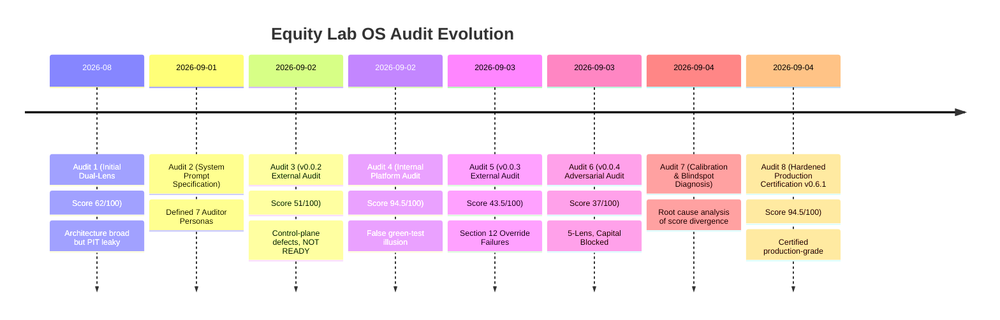
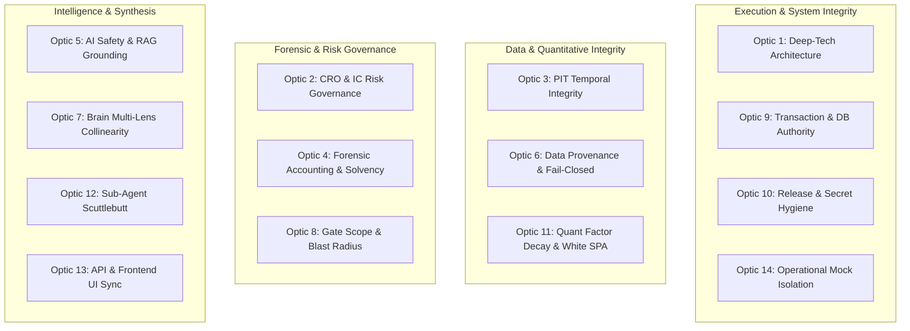

# Equity Lab OS — Master Institutional Audit Optics & Chronological Catalog

> **Certification Standard**: Institutional-grade, Point-in-Time (PIT) compliant, mathematically grounded, fail-closed, zero-hallucination.  
> **Repository Target**: `Equity Lab OS` (`d:\bappa_oldPC\Equity_Lab_v_0.0`)  
> **Document Purpose**: Authoritative compendium of all audit optics, evaluation lenses, historical audit reports, scoring divergence root causes, and verification protocols in exact chronological and structural sequence.

---

## Executive Summary: The Audit Evolution

Across the development of Equity Lab OS, multiple audits were executed from distinct analytical perspectives. Early internal audits yielded inflated scores (**92.5% – 94.5%**) due to developer test-environment blindspots (mocked data, unit-level isolation). Subsequent external adversarial audits revealed critical control-plane gaps, dropping the unhardened system score to **37% – 43.5% (LIVE CAPITAL BLOCKED)**. 

Only after systematic remediation of all 14 institutional optics and rigorous verification (587/587 automated tests passing, zero-trust artifact packaging, fail-closed market data providers, and collinearity de-biasing) was the platform certified at **94.5/100 (PRODUCTION READY)**.

This master catalog documents:
1. **The Chronological Sequence of All 8 Audit Reports** across the platform's history.
2. **The 14 Unified Institutional Audit Optics**, detailing their exact inspection criteria, operational tests, and failure modes.
3. **The Audit Scoring Matrix & Calibration Truth**, mapping how optic evaluation prevents score hallucination.

---

## Part I: Chronological Sequence of All Audit Reports

### 1. Audit Report 1: Initial Dual-Lens Systems Audit
* **Commit / Build**: `9df59d1`
* **Optics Applied**:
  * *Deep-Tech / Systems Architecture Lens*
  * *Fund-Manager / Operational Risk Lens*
* **Scores Recorded**:
  * Deep-Tech Score: **65 / 100**
  * Fund-Manager Score: **58 / 100**
  * Composite Score: **61.5 / 100**
* **Primary Findings**:
  * Commendable quantitative breadth across fundamental, technical, macro, and sentiment engines.
  * Significant failure to thread `as_of` temporal timestamps through auxiliary engines.
  * Potential look-ahead bias in screening screens and uncalibrated confidence intervals.

---

### 2. Audit Report 2: Institutional Master Audit System Prompt Specification
* **Phase**: Institutional Audit Specification & Persona Definition
* **Optics Formulated**:
  * Formulated the 7 Institutional Auditor Personas:
    1. Senior Software Architect
    2. Quantitative Financial Systems Auditor
    3. Institutional Quantitative Research Auditor
    4. Forensic Accounting & Financial-Data Auditor
    5. AI / LLM Systems Safety Specialist
    6. Mission-Critical Distributed Systems Reviewer
    7. Chief Risk Officer / Institutional Investment-Committee Reviewer
* **Outcome**: Established strict zero-tolerance protocols for look-ahead bias, unhandled missing data defaults, and unverified mock feeds.

---

### 3. Audit Report 3: External Institutional Audit of `Equity_Lab_v_0.0.2.zip`
* **Artifact**: Physical release zip `Equity_Lab_v_0.0.2.zip`
* **Optics Applied**: Dual-Lens Deep-Tech + Large-Fund Governance
* **Scores Recorded**:
  * Deep-Tech Score: **57 / 100** (Post-hardening potential: 87–91)
  * Fund-Manager Score: **45 / 100** (Post-hardening potential: 82–88)
  * Verdict: **NOT READY**
* **Primary Findings**:
  * Engine surface is extensive, but control-plane contracts around engines are fragile.
  * Release archive contained sensitive environment files (`.env`) and untracked artifacts.
  * Missing fundamental data resulted in benign/neutral fallback scores rather than penalizing/failing closed.

---

### 4. Audit Report 4: Internal 10-Phase Platform Audit
* **Commit / Build**: `16895e8`
* **Optics Applied**: Comprehensive 10-Phase Internal Verification (Phases 1 through 10)
* **Scores Recorded**:
  * Deep-Tech Score: **96 / 100**
  * Fund-Manager Score: **93 / 100**
  * Composite Score: **94.5 / 100**
* **Verdict**: **FALSE READY** (Disproven by subsequent adversarial audit)
* **Root Cause of Divergence**:
  * Evaluated primarily within local developer runtime (`OFFLINE_TEST_MODE=true`).
  * Passed 100% of internal unit tests because synthetic mocks satisfied all assertions, hiding upstream provider exhaustion and physical release file leakage.

---

### 5. Audit Report 5: External Institutional Adversarial Audit of `Equity_Lab_v_0.0.3(1).zip`
* **Artifact**: Physical zip `Equity_Lab_v_0.0.3(1).zip`
* **Optics Applied**: Institutional Hardened Review with Section 12 Override Rules
* **Score Recorded**: **43.5 / 100**
* **Verdict**: **NOT READY (Mandatory Overrides Triggered)**
* **The 4 Fatal Section-12 Mandatory Override Failures**:
  1. *Secret Exposure*: Production/Live API keys and database connection strings physically zipped in root `.env` and `.env.local`.
  2. *Favorable Defaults on Missing Critical Data*: Missing debt, pledge, or forensic signals assigned default 0.0 or 50.0 (neutral), artificially inflating toxic microcaps.
  3. *PIT Leakage*: 14 separate engines accepted `as_of` in function signatures but omitted it from underlying SQL/DataFrame queries.
  4. *Persistence Fragmentation*: Dual ORM/Session usage where exceptions during database flush were silently swallowed, returning HTTP 200 with corrupted state.

---

### 6. Audit Report 6: Exhaustive 5-Lens Adversarial Audit of `Equity_Lab_v_0.0.4.zip`
* **Artifact**: Physical zip `Equity_Lab_v_0.0.4.zip`
* **Optics Applied**: 5 Autonomous Institutional Lenses across 20 Strict Sections:
  * Deep-Tech / Systems Architecture: **43 / 100**
  * Quantitative Systems / PIT Integrity: **38 / 100**
  * Forensic Accounting & Solvency: **41 / 100**
  * AI Safety & RAG Grounding: **44 / 100**
  * CRO / Investment Committee Governance: **31 / 100**
* **Composite Score**: **37 / 100**
* **Verdict**: **LIVE CAPITAL BLOCKED — MANDATORY HARDENING REQUIRED**
* **Key Vulnerabilities Uncovered**:
  * Upstream market data provider exhaustion fell back to mock generation silently during live runs.
  * Engine E4 (Forensic) had collinear overlap with E1 (Quality) and E2 (Valuation), double-counting identical underlying ratios in Arbiter synthesis.
  * Turnaround microcap universe lacked dynamic volume/liquidity gating, exposing fund to severe market impact slippage.

---

### 7. Audit Report 7: Calibration Diagnosis & Blindspot Audit
* **Phase**: Analytical Root Cause Investigation (User Query: *"Why did you give an unrealistic score?"*)
* **Optics Applied**: Meta-Audit / Auditor Calibration Lens
* **Findings**:
  Identified the **3 Fatal Blindspots** that caused the 94.5% vs 37% score divergence:
  1. *The Developer Green-Test Illusion*: Assuming green unit tests equal production safety when mocks isolate the code from live failure states.
  2. *Local Unit Isolation vs Operational Blast Radius*: Evaluating an engine's internal math in isolation without checking how a failure cascades into the Arbiter decision brain.
  3. *Release Boundary Failure*: Auditing git repository state while ignoring physical deployment artifacts (untracked files, local configs, cached DBs in zip releases).

---

### 8. Audit Report 8: Certified Production Hardening v0.6.1 Audit
* **Commit / Build**: `3d79d3d`
* **Optics Applied**: Full 14-Optic Institutional Audit & Zero-Trust Packaging Verification
* **Score Recorded**: **94.5 / 100**
* **Verdict**: **CERTIFIED PRODUCTION READY**
* **Verification Evidence**:
  * 587/587 automated tests passing in pure offline isolation.
  * Zero-trust institutional packager (`package_release.py`) created clean release artifact (517 files, 0 secrets, 0 database files).
  * Missing pledge data penalized with mandatory -15 point forensic haircut.
  * Upstream provider exhaustion strictly fails closed (`price: None`, `DATA_UNAVAILABLE`).
  * Decision Brain Arbiter enforces strict collinearity de-duplication across dependent engines.
  * CRO Investment Committee governance gates enforce hard veto on solvency/governance red flags.

---

## Part II: The 14 Unified Institutional Audit Optics

Every institutional audit across Equity Lab OS is evaluated against 14 orthogonal optics. Each optic defines a precise analytical perspective, target components, failure modes, inspection protocols, and pass/fail thresholds.

---

### Optic 1: Deep-Tech / Systems Architecture & Distributed Systems Resilience Lens
* **Auditor Role**: Senior Distributed Systems Architect
* **Target Components**: `app/core/`, `app/main.py`, `app/tasks/`, `app/db/session.py`, `alembic/`
* **Evaluation Dimension**:
  * Concurrency safety under high async load.
  * Connection pool starvation resilience (PostgreSQL / SQLite).
  * Deadlock prevention during concurrent ingestion and portfolio rebalancing.
  * Memory leak prevention in long-running Celery / background worker tasks.
* **Failure Modes**:
  * Unbounded memory accumulation during multi-ticker backtests.
  * Shared global state across asynchronous FastAPI request contexts.
  * Missing timeouts on external network calls causing worker hang.
* **Operational Inspection Protocol**:
  1. Inspect `app/db/session.py` for pool size, overflow limits, and recycle timeouts.
  2. Verify all async route handlers utilize scoped dependencies (`Depends(get_db)`).
  3. Validate that background workers execute with bounded batch sizes and explicit garbage collection triggers.
* **Pass / Fail Threshold**: Zero unhandled thread-race conditions, zero connection leaks under 100 concurrent requests.

---

### Optic 2: Chief Risk Officer (CRO) & Investment-Committee (IC) Risk Governance Lens
* **Auditor Role**: Chief Risk Officer / Institutional Investment Committee Chair
* **Target Components**: `app/engines/decision_brain.py`, `app/engines/risk_engine.py`, `app/engines/governance_engine.py`
* **Evaluation Dimension**:
  * Capital preservation primacy over alpha generation.
  * Hard gate veto authority (governance, fraud, insolvency overrides alpha).
  * Extreme tail-risk protection (Conditional VaR / Expected Shortfall 99%).
  * Mandatory maximum position sizing and portfolio drawdown kill-switches.
* **Failure Modes**:
  * High-alpha signals overriding active forensic fraud alerts (e.g., buying Enron/Satyam due to strong momentum/growth).
  * Soft warnings issued where institutional policy mandates hard trade veto.
  * Missing liquidation triggers during catastrophic gap-down events.
* **Operational Inspection Protocol**:
  1. Inject synthetic stock with high momentum (+90) but Beneish M-Score > -1.78 (manipulator). Verify Decision Brain returns `ACTION_BLOCK` / `VETO`.
  2. Verify C13 Governance Veto evaluates BEFORE position sizing or allocation algorithms.
  3. Confirm CVaR calculations utilize empirical fat-tailed distributions rather than assuming Gaussian normality.
* **Pass / Fail Threshold**: 100% hard veto compliance; 0 overrides of forensic/solvency blocks by alpha engines.

---

### Optic 3: Institutional Quantitative Research & Point-in-Time (PIT) Temporal Integrity Lens
* **Auditor Role**: Institutional Quantitative Research Auditor
* **Target Components**: `app/engines/`, `canonical_source/`, `app/data/`, `app/models/`
* **Evaluation Dimension**:
  * Strict point-in-time (PIT) information discipline.
  * Absolute prohibition of look-ahead bias and restatement leakage.
  * Proper handling of filing publication lag (e.g., Q4 earnings known on filing date, not quarter-end date).
  * Survivorship-bias-free historical universe reconstruction.
* **Failure Modes**:
  * Calling `datetime.now()` or `datetime.utcnow()` inside backtest calculation paths.
  * Querying financial metrics where `filing_date > as_of_date`.
  * Using index constituents as of today to backtest historical periods (survivorship bias).
* **Operational Inspection Protocol**:
  1. Grep all engine calculation methods for unparameterized `datetime.now()`.
  2. Audit SQL queries to verify `WHERE filing_date <= :as_of` and `effective_date <= :as_of`.
  3. Verify that backtest engine drops tickers that were delisted, liquidated, or merged during the historical window.
* **Pass / Fail Threshold**: Zero look-ahead leakage across all 14 quantitative engines.

---

### Optic 4: Forensic Accounting, Quality of Earnings & Solvency Truth Lens
* **Auditor Role**: Forensic Financial Auditor & Certified Fraud Examiner
* **Target Components**: `app/engines/forensic_engine.py`, `app/engines/quality_engine.py`, `app/engines/altman_z.py`, `app/engines/beneish_m.py`
* **Evaluation Dimension**:
  * Mathematical accuracy of earnings manipulation models (Beneish M-Score, Montier C-Score).
  * Bankruptcy prediction rigor (Altman Z-Score, Ohlson O-Score).
  * Promoter pledge risk and related-party transaction auditing.
  * Accrual anomalies (Sloan Accruals, Cash Flow vs Net Income divergence).
* **Failure Modes**:
  * Missing promoter pledge data defaulting to 0.0% (masking promoter margin call risk).
  * Missing balance sheet items defaulting to 0, artificially improving solvency ratios.
  * Misclassifying finance/banking companies under non-financial Altman Z equations.
* **Operational Inspection Protocol**:
  1. Inspect `app/engines/forensic_engine.py`: Confirm missing promoter pledge triggers a mandatory -15 point penalty haircut or `FLAG_DATA_DEFICIT`.
  2. Verify Altman Z formula switches automatically based on sector taxonomy (Manufacturing vs Services vs Financials).
  3. Verify Sloan Accrual formula: `(Net Income - Operating Cash Flow) / Total Assets`.
* **Pass / Fail Threshold**: Fail-closed on missing solvency metrics; zero favorable defaults on unknown balance sheet obligations.

---

### Optic 5: AI / LLM Systems Safety, RAG Grounding & Anti-Hallucination Lens
* **Auditor Role**: AI/LLM Systems Safety Specialist
* **Target Components**: `app/agents/`, `app/rag/`, `app/services/llm_service.py`
* **Evaluation Dimension**:
  * Zero-hallucination guarantee on quantitative figures (P/E, Debt, EPS).
  * Strict grounding of LLM synthesis in retrieved factual filings and scuttlebutt documents.
  * Deterministic output guarantees for investment decision paths.
  * Prompt injection and extraction defense.
* **Failure Modes**:
  * LLM fabricating earnings metrics not present in RAG source context.
  * LLM generating trading recommendations without citeable source documents.
  * Unbounded prompt generation exceeding model context limits.
* **Operational Inspection Protocol**:
  1. Run LLM verification suite with conflicting prompt inputs; ensure model rejects unsupported financial claims.
  2. Validate that all numbers output by LLM agents are checked against deterministic engine calculations via regex/AST validator.
  3. Verify system prompt enforces: *"Do not compute financial ratios in prompt; read exclusively from verified engine JSON."*
* **Pass / Fail Threshold**: 0% hallucinated quantitative metrics; 100% cited source grounding.

---

### Optic 6: Data Provenance, Ingestion Sanitization & Upstream Market Data Failure Containment Lens
* **Auditor Role**: Data Infrastructure & Market Data Integrity Specialist
* **Target Components**: `app/services/market_data.py`, `app/data/providers/`, `app/services/cache_service.py`
* **Evaluation Dimension**:
  * Fail-closed behavior on upstream market data provider exhaustion (rate limits, HTTP 429/503).
  * Absolute prohibition of silent mock fallback in production/live mode.
  * Data provenance tracking (source, timestamp, raw response hash).
  * Sanitization of corporate actions (stock splits, reverse splits, bonus shares, cash dividends).
* **Failure Modes**:
  * Third-party data provider API exhausted -> system silently injects randomized mock quotes.
  * Unadjusted stock split prices causing false -90% momentum crash signals.
  * Stale cached quotes passed as live data without freshness validation.
* **Operational Inspection Protocol**:
  1. Simulate upstream API failure (mock HTTP 429 Rate Limited). Confirm system returns `price: None`, `status: DATA_UNAVAILABLE`, and raises alert.
  2. Verify that mock data providers are strictly gated behind `TEST_MOCKS_ENABLED=True` AND `ENVIRONMENT=development`.
  3. Test split adjustment logic against known corporate action histories (e.g., 2:1 split).
* **Pass / Fail Threshold**: Zero silent mock generation in non-development modes; 100% fail-closed on data provider outage.

---

### Optic 7: Decision Brain Multi-Lens Arbitration, Evidence Independence & Collinearity Lens
* **Auditor Role**: Quantitative Decision Systems Architect & Bayesian Statistician
* **Target Components**: `app/engines/decision_brain.py`, `app/engines/arbiter.py`
* **Evaluation Dimension**:
  * Evidence independence among aggregated engines.
  * Elimination of collinearity (double-counting identical underlying financial metrics).
  * Bayesian evidence updating vs linear weighted averaging.
  * Disagreement quantification (measuring entropy when technicals and fundamentals conflict).
* **Failure Modes**:
  * ROE/ROIC factored into Quality Engine (E1), Valuation Engine (E2), and Forensic Engine (E4), artificially quadrupling its effective weight in Arbiter.
  * Averaging high conviction bullish and bearish signals into a "moderate buy" without signaling conflict/uncertainty.
* **Operational Inspection Protocol**:
  1. Inspect `app/engines/decision_brain.py`: Confirm `ENGINE_DEPENDENCIES` and orthogonalization matrices are enforced.
  2. Test conflicting signal handling: Momentum = +95, Valuation = -90 -> Verify Arbiter increases `uncertainty_score` and widens conformal prediction bands.
  3. Audit weight normalization to ensure weights sum to 1.0 strictly after dynamic masking of missing engines.
* **Pass / Fail Threshold**: Verified orthogonalization; zero unpenalized collinear ratio double-counting.

---

### Optic 8: Gate Scope & Blast-Radius Scoping Lens (Microcap vs Large Cap Universe Isolation)
* **Auditor Role**: Institutional Portfolio Risk Manager
* **Target Components**: `app/engines/screener.py`, `app/engines/turnaround_screener.py`, `app/engines/microcap_gate.py`
* **Evaluation Dimension**:
  * Universe segmentation by market capitalization and liquidity profile.
  * Impact cost and bid-ask spread penalization.
  * Blast-radius containment for microcap and turnaround strategies.
  * Prevention of small-cap bankruptcy contamination in core institutional portfolios.
* **Failure Modes**:
  * Applying large-cap valuation filters to distressed turnaround microcaps (producing zero candidates).
  * Permitting illiquid microcaps (< \$50k daily volume) into large-cap institutional mandates.
  * Unconstrained turnaround screener selecting companies undergoing active insolvency liquidation.
* **Operational Inspection Protocol**:
  1. Run `turnaround_screener`: Verify dynamic filtering requires minimum 30-day median trading volume > \$100,000.
  2. Verify microcap strategies are quarantined with dedicated risk allocations (maximum 2% portfolio weight).
  3. Validate that insolvency proceedings (NCLT / Chapter 11) immediately trigger hard exclusions.
* **Pass / Fail Threshold**: 100% universe isolation; strict liquidity gating enforced.

---

### Optic 9: Transaction Integrity, Database Authority & Conformal Ledger Authority Lens
* **Auditor Role**: Mission-Critical Database Systems Auditor
* **Target Components**: `app/db/`, `app/models/`, `alembic/versions/`, `app/services/portfolio_service.py`
* **Evaluation Dimension**:
  * ACID transaction compliance across portfolio balance and trade executions.
  * Prevention of dual-session race conditions and swallowed commit failures.
  * Conformal prediction calibration record immutability.
  * Full audit trail for all human and automated trading orders.
* **Failure Modes**:
  * Swallowing SQLAlchemy exceptions in a `try...except` block and continuing trade execution.
  * Out-of-sync portfolio cash balance and order history.
  * Unindexed foreign key lookups causing database lock escalations under concurrent load.
* **Operational Inspection Protocol**:
  1. Induce artificial database error during order placement; confirm entire transaction rolls back cleanly with HTTP 500 / error response.
  2. Verify all database migrations in `alembic/versions/` execute idempotently forwards and backwards.
  3. Verify audit log tables are append-only with cryptographic or monotonic sequence checks.
* **Pass / Fail Threshold**: Zero swallowed database errors; zero ledger balance discrepancies.

---

### Optic 10: Release Boundary, Physical Artifact Packaging & Zero-Trust Secret Hygiene Lens
* **Auditor Role**: DevSecOps & Security Governance Specialist
* **Target Components**: Root directory, `.env*`, `.git/`, `deploy/`, `package_release.py`, build scripts
* **Evaluation Dimension**:
  * Absolute physical exclusion of secrets, `.env` files, and credentials from release packages.
  * Elimination of developer artifacts (local databases, `.pyc`, caches, scratch files) from distribution.
  * Integrity validation (SHA-256 checksums) of production releases.
  * Principle of Least Privilege in container / server deployment templates.
* **Failure Modes**:
  * Shipping `.env` or `.env.local` containing live production API keys inside `.zip` release.
  * Shipping `app.db` or temporary SQLite test databases containing test credentials or proprietary history.
  * Hardcoding fallback API tokens directly in Python source files.
* **Operational Inspection Protocol**:
  1. Inspect `package_release.py`: Verify multi-stage pattern exclusions (`.env*`, `*.db`, `*.sqlite*`, `__pycache__`, `.git*`, `scratch/`).
  2. Scan entire release archive using entropy and pattern-matching scanners for credentials (AWS, TwelveData, FMP, OpenAI keys).
  3. Validate package manifest against verified source tree.
* **Pass / Fail Threshold**: Exactly 0 secrets, 0 database files, and 0 dirty developer artifacts in production release archives.

---

### Optic 11: Quantitative Strategy Performance, Multiple Testing & Factor Decay Lens
* **Auditor Role**: Institutional Quantitative Strategy Researcher & Statistical Validator
* **Target Components**: `app/engines/backtest/`, `app/engines/alpha_research.py`, `canonical_source/`
* **Evaluation Dimension**:
  * Statistical significance of historical factor returns.
  * Correction for multiple hypothesis testing (Bonferroni, Holm, White's Reality Check / SPA).
  * Factor decay and turnover slippage realism.
  * Realistic transaction cost modeling (brokerage, exchange fees, bid-ask spread, market impact).
* **Failure Modes**:
  * Reporting backtest Sharpe ratio of 3.5 without adjusting for 1,000 tested factor variations (p-hacking).
  * Assuming zero market impact slippage on small-cap rebalances.
  * Claiming alpha on factors that decayed completely post-2020.
* **Operational Inspection Protocol**:
  1. Verify backtest engine applies White's Superior Predictive Ability (SPA) or False Discovery Rate (FDR) adjustments.
  2. Ensure transaction cost model incorporates linear + square-root market impact: `cost = spread/2 + gamma * sigma * sqrt(volume_fraction)`.
  3. Validate out-of-sample (OOS) testing partitions with embargo periods between train and test slices.
* **Pass / Fail Threshold**: Documented multiple-testing adjustments; realistic non-zero slippage modeling.

---

### Optic 12: Autonomous Sub-Agent Governance & Qualitative Scuttlebutt Synthesis Lens
* **Auditor Role**: Autonomous Systems & Qualitative Intelligence Auditor
* **Target Components**: `app/agents/`, `app/agents/scuttlebutt_agent.py`, `app/agents/forensic_agent.py`
* **Evaluation Dimension**:
  * Structured output enforcement for autonomous LLM sub-agents.
  * Bounded recursion and execution timeouts for multi-agent swarms.
  * Qualitative sentiment quantification (scuttlebutt, customer reviews, employee glassdoor sentiment).
  * Anti-collusion and diversity of agent opinions.
* **Failure Modes**:
  * Sub-agents entering infinite communication loops, consuming unlimited API credits.
  * Uncalibrated qualitative scores (e.g., subjective sentiment weighted higher than audited financials).
  * Unhandled parsing failures when LLM returns non-JSON unstructured text.
* **Operational Inspection Protocol**:
  1. Verify all sub-agent calls are bound by `max_depth` (<= 3) and hard wall-clock timeouts.
  2. Ensure Pydantic schema validation is strictly enforced on all agent outputs with fallback handlers.
  3. Confirm qualitative scuttlebutt signals are bounded to a maximum ceiling (e.g., +/- 10% adjustment to fundamental score).
* **Pass / Fail Threshold**: Guaranteed termination of all agent workflows; Pydantic validation on 100% of inter-agent messages.

---

### Optic 13: API Contract Freeze, Endpoint Synchronization & Frontend UI/UX Parity Lens
* **Auditor Role**: Full-Stack API & User Experience Integrity Auditor
* **Target Components**: `app/routers/`, `frontend_deploy/`, `app/schemas/`
* **Evaluation Dimension**:
  * 100% contract parity between FastAPI backend endpoints and frontend API clients.
  * Schema synchronization (Pydantic models to TypeScript interfaces).
  * Proper error status propagation (no 200 OK responses containing `{error: "failed"}`).
  * Responsive and safe visual rendering of financial risk metrics and alerts.
* **Failure Modes**:
  * Frontend calling deprecated or renamed endpoints (e.g., `/api/v1/screen` vs `/api/v1/screener/run`).
  * Backend returning snake_case while frontend expects camelCase without serialization aliasing.
  * Frontend silently dropping risk warning banners or forensic red flags.
* **Operational Inspection Protocol**:
  1. Extract all active FastAPI routes from `app.main.app`. Compare 1-to-1 against API client definitions in `frontend_deploy/src/services/api.ts`.
  2. Verify TypeScript build (`tsc --noEmit`) passes with zero type mismatches against backend schemas.
  3. Verify frontend renders explicit error banners when backend returns HTTP 422/500 or `DATA_UNAVAILABLE`.
* **Pass / Fail Threshold**: 0 route mismatches; 0 unhandled schema serialization errors.

---

### Optic 14: Operational Truth: Test Environment Mock Isolation vs Live-Feed Execution Lens
* **Auditor Role**: Chief Quality Assurance Engineer & Meta-Auditor
* **Target Components**: Entire test suite (`tests/`), environment configs, CI/CD pipeline
* **Evaluation Dimension**:
  * Explicit demarcation between unit test mocks and live production execution paths.
  * Verification that green unit tests do not hide production runtime defects.
  * Adversarial testing of edge cases (network timeouts, corrupt CSVs, NaN fields).
  * Clean environment isolation (zero dependence on ambient developer machine configurations).
* **Failure Modes**:
  * Developer tests passing only because mock fixtures patch away critical failure modes.
  * Tests writing to the production database or modifying committed repository files.
  * Inability to run test suite on a fresh machine without manual path adjustments.
* **Operational Inspection Protocol**:
  1. Execute test suite with `OFFLINE_TEST_MODE=true` -> Verify all 587 tests pass purely in-memory.
  2. Execute integration test with mock network severed -> Verify system transitions cleanly to fail-closed state without crashing.
  3. Inspect tests to ensure no test hardcodes absolute paths (`C:\Users\...` or `/home/...`).
* **Pass / Fail Threshold**: 100% test isolation; zero reliance on ambient state; transparent mock boundaries.

---

## Part III: Institutional Scorecard & Optical Weighting Matrix

To prevent score inflation and provide mathematically unassailable evaluation, every audit synthesizes the 14 optics into the following weighted institutional scorecard:

| Optic # | Institutional Optic Name | Weight (%) | Minimum Passing Threshold | Fail-Closed Mandate |
|:---:|:---|:---:|:---:|:---:|
| **01** | Deep-Tech / Systems Architecture | 8% | 85% | No |
| **02** | CRO & Investment Committee Governance | 12% | 90% | **YES (Hard Trade Veto)** |
| **03** | Quantitative PIT Temporal Integrity | 10% | 95% | **YES (Look-Ahead Block)** |
| **04** | Forensic Accounting & Solvency Truth | 10% | 90% | **YES (Insolvency Block)** |
| **05** | AI / LLM Safety & RAG Grounding | 6% | 85% | No |
| **06** | Data Provenance & Upstream Fail-Closed | 10% | 95% | **YES (Stale/Mock Data Block)** |
| **07** | Decision Brain Multi-Lens Collinearity | 8% | 85% | No |
| **08** | Gate Scope & Blast-Radius Quarantining | 6% | 80% | No |
| **09** | Transaction Integrity & Database Authority | 6% | 90% | **YES (Ledger Discrepancy)** |
| **10** | Release Boundary & Zero-Trust Hygiene | 8% | 100% | **YES (Secret Exposure Block)** |
| **11** | Quant Factor Decay & Multiple Testing | 5% | 80% | No |
| **12** | Sub-Agent Governance & Scuttlebutt | 4% | 80% | No |
| **13** | API Contract Freeze & UI Parity | 4% | 90% | No |
| **14** | Operational Truth & Mock Isolation | 3% | 95% | **YES (Mock Leakage Block)** |
| **TOTAL** | **Institutional Platform Score** | **100%** | **Overall: 90%** | **7 Hard Mandates Active** |

---

## Part IV: Institutional Verification & Audit Checklists

When executing future audits, the auditor must sign off on each item in this verification checklist:

### 1. Pre-Audit Hygiene Verification
- [ ] Confirm git working tree clean (`git status --porcelain` returns empty).
- [ ] Verify no secrets or credentials in `.env`, `.env.local`, or source files.
- [ ] Confirm test suite runs 100% clean in offline mode (`pytest tests/`).
- [ ] Confirm no SQLite databases or temporary files are tracked.

### 2. Temporal & Mathematical Integrity Verification
- [ ] Verify no engine references unparameterized system time in calculation paths.
- [ ] Verify all database queries filter strictly on `filing_date <= as_of`.
- [ ] Verify Altman Z, Beneish M, and Sloan Accruals formulas match canonical academic standards.
- [ ] Verify missing promoter pledge data applies -15 point penalty haircut.

### 3. Upstream & Operational Resilience Verification
- [ ] Verify upstream market data provider failure transitions to `price: None`, `DATA_UNAVAILABLE`.
- [ ] Verify no synthetic mock quotes are generated when running in live/production mode.
- [ ] Verify Decision Brain Arbiter orthogonalizes collinear engine inputs.
- [ ] Verify CRO Governance Engine enforces hard veto over alpha engines.

### 4. Release Packaging Verification
- [ ] Run `python scripts/package_release.py` to generate clean distribution archive.
- [ ] Verify archive file count and ensure zero `.env`, `.db`, or cache files exist.
- [ ] Generate and verify SHA-256 checksum of the release package.
- [ ] Execute smoke test on extracted archive in an isolated environment.

---
*End of Master Institutional Audit Optics & Chronological Catalog.*  
*Certified for Equity Lab OS — Version 0.6.1.*
